# 🛡️ Splunk · Sysmon · Atomic Red Team — SOC Detection Lab

> A complete home SOC lab built on two virtual machines. Sysmon telemetry from a Windows Server 2019 endpoint is forwarded to Splunk Enterprise on Kali Linux. Five MITRE ATT&CK techniques are simulated using Atomic Red Team and detected with SPL queries.

---

## 📋 Table of Contents

1. [Lab Overview](#1-lab-overview)
2. [Lab Architecture](#2-lab-architecture)
3. [Prerequisites & Downloads](#3-prerequisites--downloads)
4. [Phase 1 — Kali Linux: Splunk Enterprise Setup](#4-phase-1--kali-linux-splunk-enterprise-setup)
5. [Phase 2 — Windows Server 2019 VM Setup](#5-phase-2--windows-server-2019-vm-setup)
6. [Phase 3 — Sysmon Installation & Verification](#6-phase-3--sysmon-installation--verification)
7. [Phase 4 — Splunk Universal Forwarder Setup](#7-phase-4--splunk-universal-forwarder-setup)
8. [Phase 5 — Log Ingestion Validation](#8-phase-5--log-ingestion-validation)
9. [Phase 6 — Atomic Red Team Installation](#9-phase-6--atomic-red-team-installation)
10. [Phase 7 — Attack Simulations & Detections](#10-phase-7--attack-simulations--detections)
    - [T1053.005 — Scheduled Task](#101-t1053005--scheduled-task-persistence)
    - [T1218.005 — MSHTA Proxy Execution](#102-t1218005--mshta-signed-binary-proxy-execution)
    - [T1003.001 — LSASS Credential Dumping](#103-t1003001--lsass-memory-credential-dumping)
    - [T1059.001 — PowerShell Execution](#104-t1059001--powershell-execution)
    - [T1112 — Registry Modification](#105-t1112--registry-modification)
11. [Splunk Dashboard](#11-splunk-dashboard)
12. [Repository Structure](#12-repository-structure)

---

## 1. Lab Overview

This lab uses two virtual machines communicating over a VMware NAT network:

| Machine | Role | Key Software |
|---|---|---|
| **Kali Linux** | SIEM / Splunk Indexer | Splunk Enterprise 10.4.0 |
| **Windows Server 2019** | Monitored Endpoint | Sysmon, Splunk UF, Atomic Red Team |

**Data flow:**

```
Windows Server 2019 (WIN-SOC-LAB)
  ├── Sysmon          →  generates detailed endpoint telemetry
  ├── Splunk UF       →  forwards Sysmon logs over TCP 9997
  └── Atomic Red Team →  simulates MITRE ATT&CK techniques
          │
          │  Sysmon logs over TCP port 9997
          ▼
Kali Linux (192.168.116.128)
  └── Splunk Enterprise
          │
          ▼
    index=wineventlog → SPL Detection Queries → Dashboard
```

**What this lab demonstrates:**
- Building a two-machine SOC environment from scratch
- Collecting deep endpoint telemetry with Sysmon
- Forwarding logs to a centralised SIEM
- Simulating five real MITRE ATT&CK adversary techniques
- Detecting each attack with purpose-built Splunk SPL queries

---

## 2. Lab Architecture

### Network Configuration

| Item | Value |
|---|---|
| Kali Linux IP (Splunk Server) | `192.168.116.128` |
| Windows Server IP (Endpoint) | `192.168.116.133` |
| Windows Hostname | `WIN-SOC-LAB` |
| Splunk Web UI Port | `8000` |
| Splunk Receiver Port | `9997` |
| Splunk Index | `wineventlog` |
| Network Type | VMware NAT |

### VM Specifications

| VM | CPU | RAM | Disk | Network |
|---|---|---|---|---|
| Kali Linux | 2 cores | 4 GB minimum | 40 GB+ | NAT |
| Windows Server 2019 | 2 cores | 4 GB minimum | 60 GB+ | NAT |

> 💡 Use 8 GB RAM per VM if your host machine supports it for smoother performance.

---

## 3. Prerequisites & Downloads

| Component | Source | Install On |
|---|---|---|
| Splunk Enterprise Linux `.deb` | [splunk.com/download](https://www.splunk.com/en_us/download/splunk-enterprise.html) | Kali Linux |
| Windows Server 2019 ISO | [Microsoft Evaluation Center](https://www.microsoft.com/en-us/evalcenter) | VMware |
| Sysmon | [Microsoft Sysinternals](https://learn.microsoft.com/en-us/sysinternals/downloads/sysmon) | Windows Server |
| Sysmon Config XML | Wazuh community config | Windows Server |
| Splunk Universal Forwarder `.msi` | [splunk.com/download/universal-forwarder](https://www.splunk.com/en_us/download/universal-forwarder.html) | Windows Server |
| Invoke-AtomicRedTeam | PowerShell Gallery | Windows Server |
| Atomic Red Team Atomics | [GitHub/redcanaryco](https://github.com/redcanaryco/atomic-red-team) | Windows Server |
| ProcDump | [Microsoft Sysinternals](https://learn.microsoft.com/en-us/sysinternals/downloads/procdump) | Windows Server (T1003.001) |

---

## 4. Phase 1 — Kali Linux: Splunk Enterprise Setup

### 4.1 Check Kali IP and Internet

Open a terminal on Kali Linux and note your IP address — you will need it throughout this lab.

```bash
hostname -I
ping -c 4 google.com
```

This lab uses Kali IP: `192.168.116.128`

---

### 4.2 Install Splunk Enterprise

Download the Linux `.deb` installer from the Splunk website. Install it with:

```bash
cd ~/Downloads
sudo dpkg -i splunk-10.4.0-f798d4d49089-linux-amd64.deb
```

> ⚠️ **Important:** Install Splunk **Enterprise** (not Universal Forwarder) on Kali. The file should be named `splunk-10.4.0-...` not `splunkforwarder-10.4.0-...`

---

### 4.3 Start Splunk Enterprise

```bash
sudo /opt/splunk/bin/splunk start --accept-license --run-as-root
```

Create your admin username and password when prompted. Then verify Splunk is running:

```bash
sudo /opt/splunk/bin/splunk status --run-as-root
# Expected: splunkd is running
```

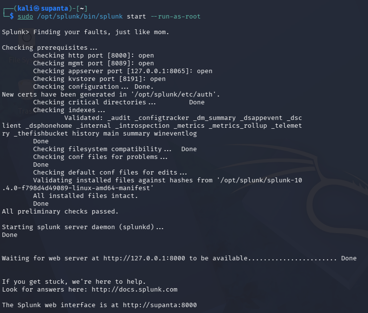

Confirm Splunk is listening on port 8000:

```bash
sudo ss -tlnp | grep 8000
```

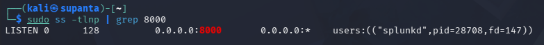

Enable Splunk to start automatically on boot:

```bash
sudo /opt/splunk/bin/splunk enable boot-start --run-as-root
```

---

### 4.4 Configure Splunk Index and Receiving Port

Open Splunk Web from the Kali browser: `http://127.0.0.1:8000`

**Create the `wineventlog` Index:**

```
Settings → Indexes → New Index
  Index Name: wineventlog
  App: search
  → Save
```

**Enable TCP Receiving on Port 9997:**

```
Settings → Forwarding and Receiving → Configure Receiving → New Receiving Port
  Port: 9997
  → Save
```

Verify Splunk is now listening on port 9997:

```bash
sudo ss -tlnp | grep 9997
# Expected: 0.0.0.0:9997 listening
```

**Access Splunk Web from Windows Browser:**

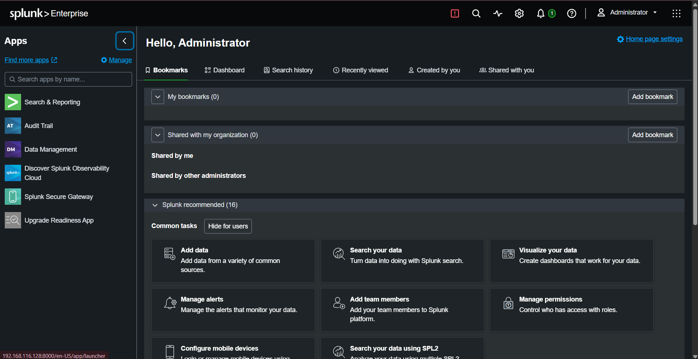

---

## 5. Phase 2 — Windows Server 2019 VM Setup

### 5.1 Create the VM in VMware Workstation

**Step 1 — Select installation method:**

Choose **"I will install the operating system later"** so you can configure the VM before mounting the ISO.

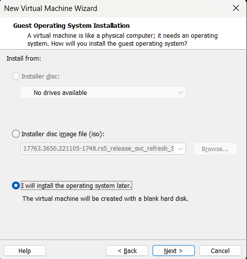

**Step 2 — Select Guest OS:**

Choose **Microsoft Windows → Windows Server 2019**.

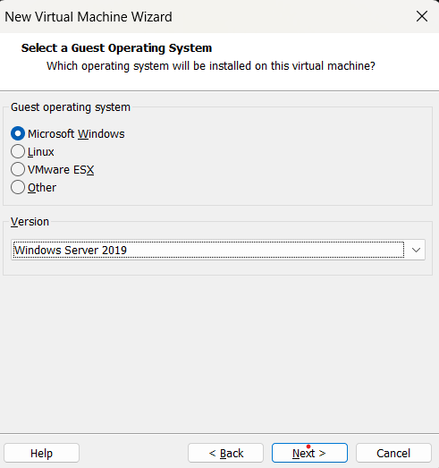

**Step 3 — Name and location:**

Set the VM name to `Windows-Server-2019-SOC-Lab`.

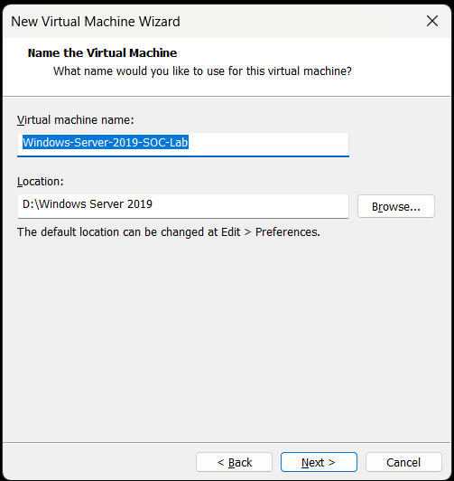

**Step 4 — Disk size:**

Set to **60 GB**, split into multiple files.

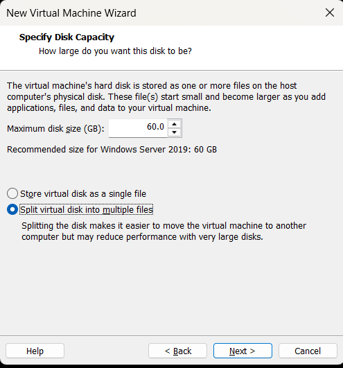

**Step 5 — Hardware summary:**

Review the configuration: 4312 MB RAM, 60 GB disk, NAT network, 2 CPU cores. Click **Finish**.

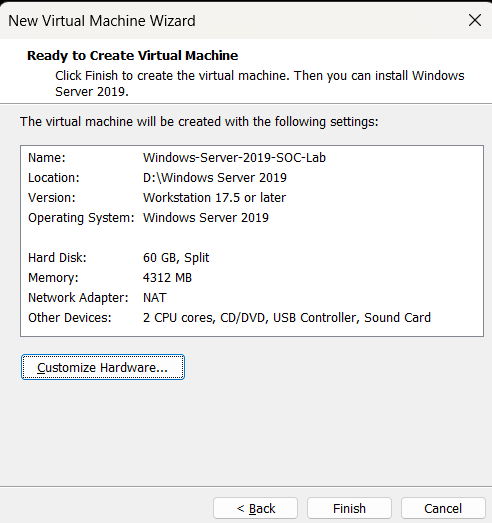

---

### 5.2 Install Windows Server 2019

Attach the Windows Server 2019 ISO, power on the VM, and boot from the CDROM.

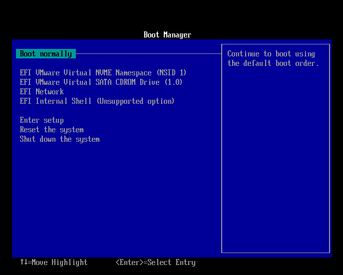

The Windows Setup wizard appears. Keep default language settings (English, US keyboard).

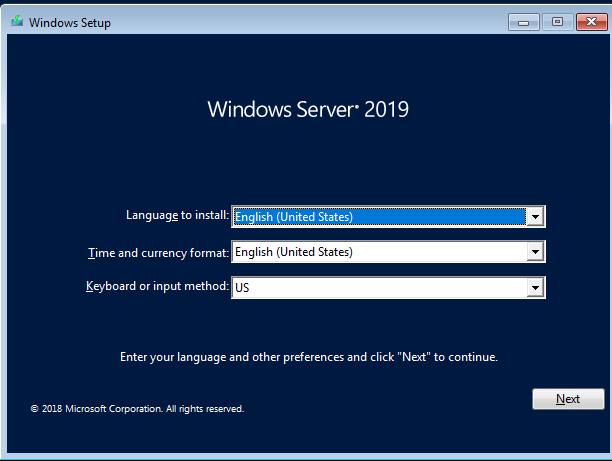

**Select the correct edition:**

Choose **Windows Server 2019 Standard Evaluation (Desktop Experience)**. Do not select Server Core — it does not provide a graphical desktop.

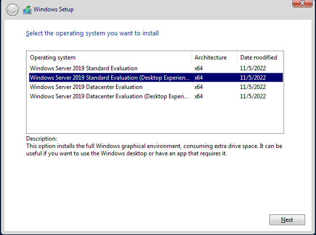

Select **Custom: Install Windows only** and pick the unallocated disk. Installation proceeds automatically.

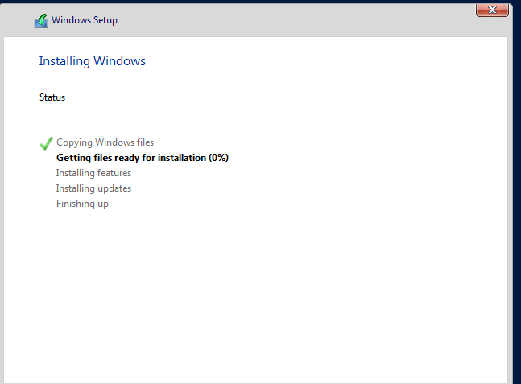

---

### 5.3 Post-Installation Configuration

After installation, install **VMware Tools** for display scaling and clipboard sharing.

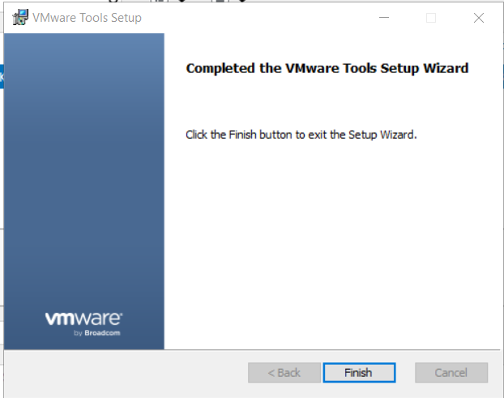

Open **PowerShell as Administrator** and verify the hostname:

```powershell
hostname
# WIN-SOC-LAB
```

To rename the computer if needed:
```powershell
Rename-Computer -NewName "WIN-SOC-LAB" -Restart
```

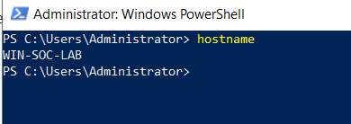

Check the Windows IP address:

```powershell
ipconfig
```

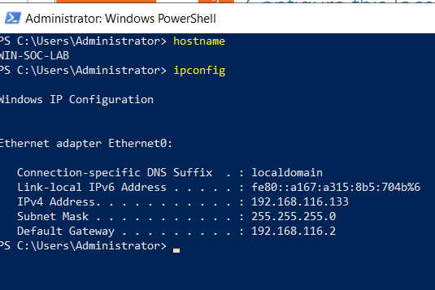

---

### 5.4 Test Connectivity to Kali

Ping the Kali Linux machine and verify port 9997 is reachable:

```powershell
ping 192.168.116.128
```

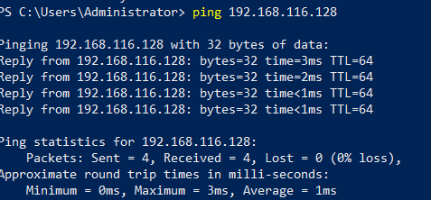

```powershell
Test-NetConnection 192.168.116.128 -Port 9997
# TcpTestSucceeded : True
```

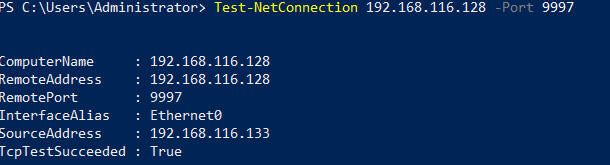

Create the Tools working directory:

```powershell
mkdir C:\Tools
cd C:\Tools
```

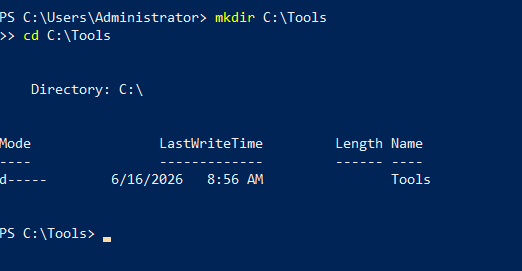

---

## 6. Phase 3 — Sysmon Installation & Verification

Sysmon (System Monitor) provides deep Windows telemetry — process creation with full command lines, network connections, file creation, registry changes, and more. It is the primary data source for all detections in this lab.

### 6.1 Download and Extract Sysmon

```powershell
Invoke-WebRequest -Uri "https://download.sysinternals.com/files/Sysmon.zip" -OutFile "C:\Tools\Sysmon.zip"
Expand-Archive C:\Tools\Sysmon.zip -DestinationPath C:\Tools\Sysmon -Force
dir C:\Tools\Sysmon
```

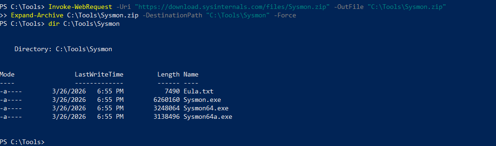

---

### 6.2 Download Sysmon Configuration

```powershell
Invoke-WebRequest -Uri "https://wazuh.com/resources/blog/emulation-of-attack-techniques-and-detection-with-wazuh/sysmonconfig.xml" -OutFile "C:\Tools\Sysmon\sysmonconfig.xml"
dir C:\Tools\Sysmon\sysmonconfig.xml
```

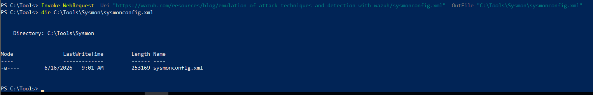

---

### 6.3 Install Sysmon

```powershell
cd C:\Tools\Sysmon
.\Sysmon64.exe -accepteula -i .\sysmonconfig.xml
```

Expected output: `Sysmon64 installed.` → `SysmonDrv started.` → `Sysmon64 started.`

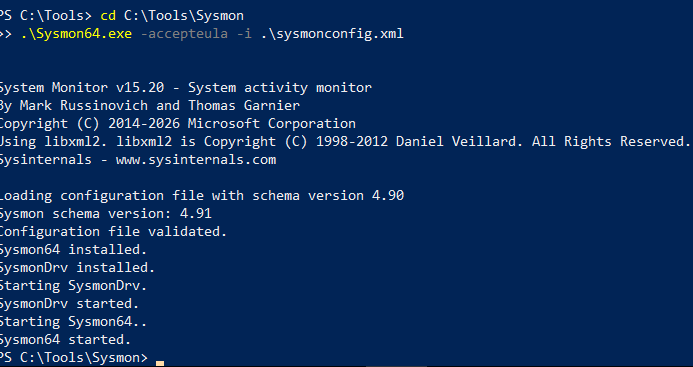

Verify the service is running:

```powershell
Get-Service Sysmon64
# Status: Running
```

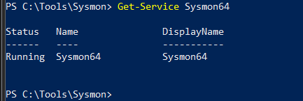

---

### 6.4 Verify Sysmon in Event Viewer

Open Event Viewer: `Win+R → eventvwr`

Navigate to: **Applications and Services Logs → Microsoft → Windows → Sysmon → Operational**

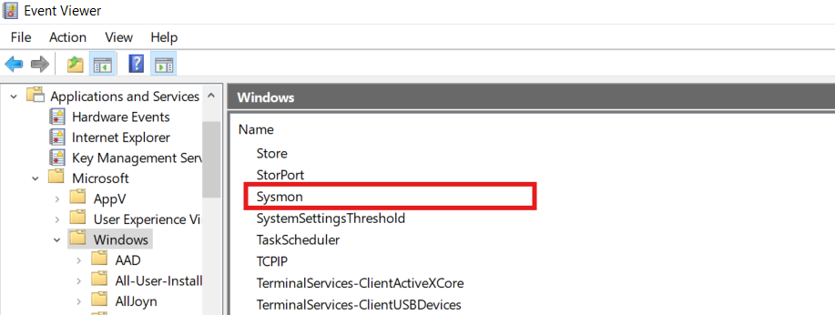

Generate test events to confirm logging is active:

```powershell
notepad.exe
calc.exe
cmd.exe /c whoami
```

Query the Sysmon log from PowerShell:

```powershell
Get-WinEvent -LogName "Microsoft-Windows-Sysmon/Operational" -MaxEvents 10 | Select-Object TimeCreated, Id, ProviderName
```

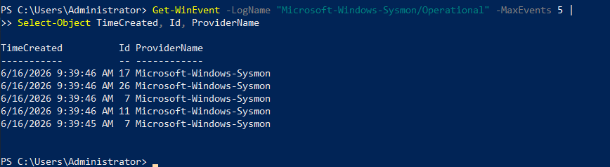

---

## 7. Phase 4 — Splunk Universal Forwarder Setup

### 7.1 Download Universal Forwarder

Download the Windows 64-bit MSI from [splunk.com](https://www.splunk.com/en_us/download/universal-forwarder.html). The file should be named `splunkforwarder-10.4.0-...-windows-x64.msi`.

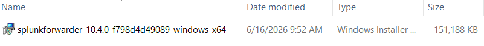

---

### 7.2 Install the Universal Forwarder

Run the MSI installer. On the **Receiving Indexer** screen, enter:

| Field | Value |
|---|---|
| Hostname or IP | `192.168.116.128` |
| Port | `9997` |

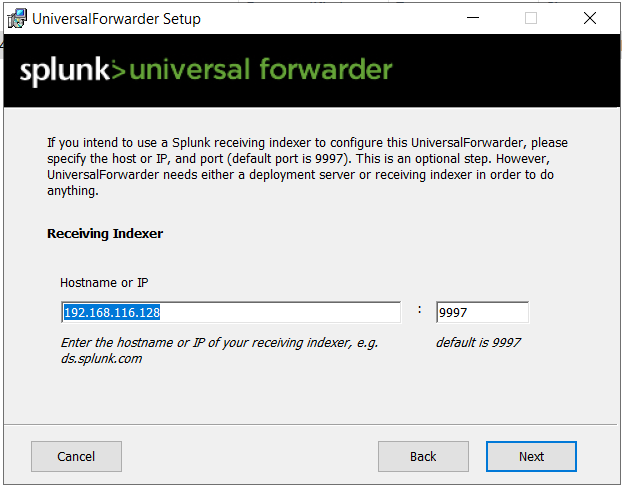

Verify the service is running after installation:

```powershell
Get-Service SplunkForwarder
# Status: Running
```

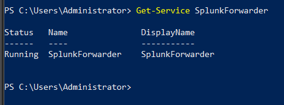

---

### 7.3 Configure inputs.conf

Navigate to `C:\Program Files\SplunkUniversalForwarder\etc\system\local\` and create `inputs.conf`:

```powershell
$SPLUNK_HOME = "C:\Program Files\SplunkUniversalForwarder"
mkdir "$SPLUNK_HOME\etc\system\local" -Force

@'
[WinEventLog://Microsoft-Windows-Sysmon/Operational]
disabled = 0
index = wineventlog
renderXml = true
'@ | Set-Content "$SPLUNK_HOME\etc\system\local\inputs.conf" -Encoding ascii
```

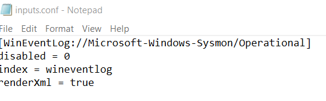

---

### 7.4 Configure outputs.conf

```powershell
@'
[tcpout]
defaultGroup = kali_indexer

[tcpout:kali_indexer]
server = 192.168.116.128:9997
'@ | Set-Content "$SPLUNK_HOME\etc\system\local\outputs.conf" -Encoding ascii
```

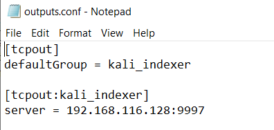

---

### 7.5 Restart and Verify Forwarding

```powershell
Restart-Service SplunkForwarder

# Confirm active forwarding:
& "C:\Program Files\SplunkUniversalForwarder\bin\splunk.exe" list forward-server
```

Expected output:
```
Active forwards:
        192.168.116.128:9997
Configured but inactive forwards:
        None
```

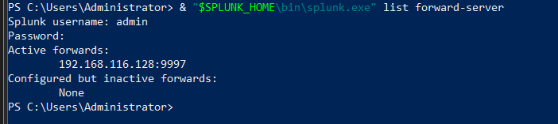

---

## 8. Phase 5 — Log Ingestion Validation

### 8.1 Confirm Sysmon Events Are Flowing

On Windows, confirm Sysmon is generating recent events:

```powershell
Get-WinEvent -LogName "Microsoft-Windows-Sysmon/Operational" -MaxEvents 10 | Select-Object TimeCreated, Id, ProviderName
```

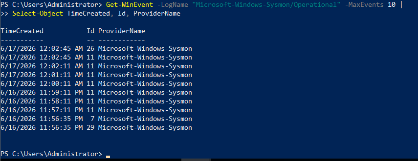

---

### 8.2 Validate in Splunk — Basic Search

In Splunk Web (`http://192.168.116.128:8000`), go to **Search & Reporting** and run:

```spl
index=wineventlog
```

Time range: **All time**

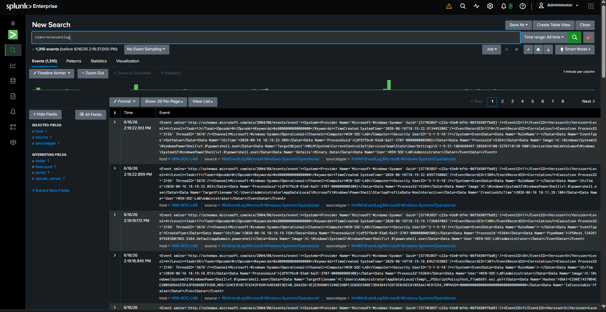

Test with known process names to confirm process-level events are arriving:

```spl
index=wineventlog "notepad.exe" OR "calc.exe" OR "whoami"
```

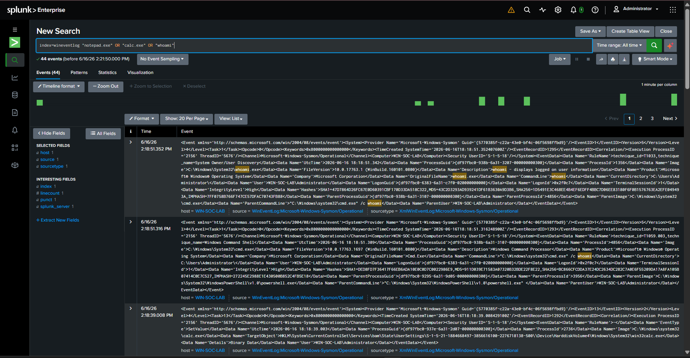

---

### 8.3 EventID 1 Validation Query

This query extracts structured fields from Sysmon's raw XML. It confirms that process creation events with full command lines are ingested correctly — the foundation of all attack detections.

```spl
index=wineventlog
| rex field=_raw "<EventID[^>]*>(?<EventID>\d+)</EventID>"
| rex field=_raw "<Data Name=[\"']UtcTime[\"']>(?<UtcTime>[^<]*)</Data>"
| rex field=_raw "<Data Name=[\"']Image[\"']>(?<ProcessName>[^<]*)</Data>"
| rex field=_raw "<Data Name=[\"']CommandLine[\"']>(?<CommandLine>[^<]*)</Data>"
| rex field=_raw "<Data Name=[\"']ParentImage[\"']>(?<ParentProcess>[^<]*)</Data>"
| search EventID=1
| table _time UtcTime host EventID ProcessName CommandLine ParentProcess
| sort - _time
```

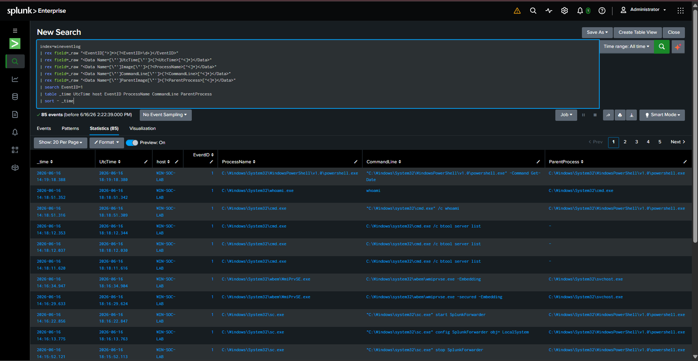

> ✅ If you can see EventID 1 rows with `ProcessName`, `CommandLine`, and `ParentProcess` populated, the full pipeline is working. Proceed to attack simulations.

---

## 9. Phase 6 — Atomic Red Team Installation

> ⚠️ **Disable Windows Defender real-time protection** before installing ART. Go to: **Windows Security → Virus & threat protection → Manage settings → Real-time protection → Off**

### 9.1 Configure PowerShell Environment

Open **PowerShell as Administrator** and run:

```powershell
Set-ExecutionPolicy Bypass -Scope Process -Force
[Net.ServicePointManager]::SecurityProtocol = [Net.SecurityProtocolType]::Tls12
Install-PackageProvider -Name NuGet -MinimumVersion 2.8.5.201 -Force
Set-PSRepository -Name "PSGallery" -InstallationPolicy Trusted
```

---

### 9.2 Install Required Modules

```powershell
Install-Module PowerShellGet -Force -AllowClobber
Install-Module powershell-yaml -Force
Install-Module Invoke-AtomicRedTeam -Force
```

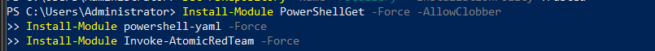

---

### 9.3 Install Atomic Red Team

```powershell
IEX (IWR 'https://raw.githubusercontent.com/redcanaryco/invoke-atomicredteam/master/install-atomicredteam.ps1' -UseBasicParsing)
Install-AtomicRedTeam -getAtomics -Force
```

Expected: `Installation of Invoke-AtomicRedTeam is complete.`

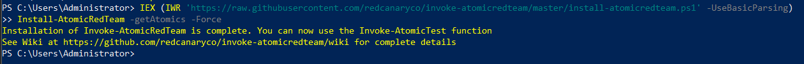

---

### 9.4 Verify Installation

```powershell
$env:PathToAtomicsFolder = "C:\AtomicRedTeam\atomics"
Import-Module Invoke-AtomicRedTeam
Get-Command Invoke-AtomicTest
```

Expected output:
```
CommandType  Name               Version  Source
Function     Invoke-AtomicTest  2.3.0    Invoke-AtomicRedTeam
```

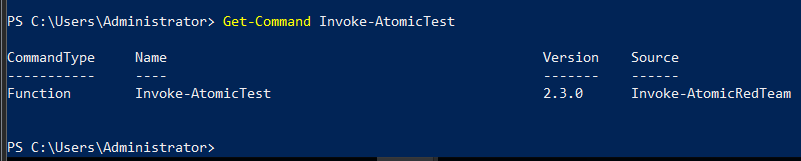

Browse available tests for any technique:

```powershell
Invoke-AtomicTest T1059.001 -ShowDetailsBrief
```

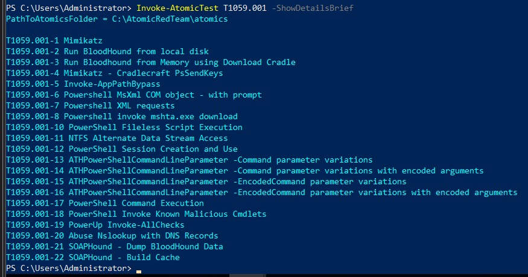

---

## 10. Phase 7 — Attack Simulations & Detections

> **Workflow for each attack:**
> 1. Run the atomic command
> 2. Wait 1–2 minutes
> 3. Run the SPL detection query in Splunk
> 4. Take screenshot
> 5. Run cleanup

Set the atomics path at the start of each PowerShell session:

```powershell
$env:PathToAtomicsFolder = "C:\AtomicRedTeam\atomics"
```

---

### 10.1 T1053.005 — Scheduled Task (Persistence)

**MITRE ATT&CK:** [T1053.005](https://attack.mitre.org/techniques/T1053/005/) | Tactic: Persistence

**What it does:** Creates scheduled tasks (`T1053_005_OnStartup`, `T1053_005_OnLogon`) that execute `calc.exe` on system start and user logon — simulating a backdoor that persists across reboots.

#### Check Prerequisites

```powershell
Invoke-AtomicTest T1053.005 -TestNumbers 1 -CheckPrereqs
```

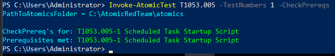

#### Execute Attack

```powershell
Invoke-AtomicTest T1053.005 -TestNumbers 1
```

Expected: Both tasks created successfully with exit code 0.

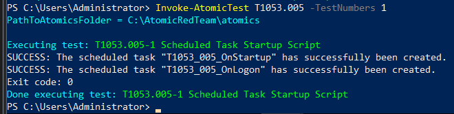

#### SPL Detection Query

```spl
index=wineventlog
| rex field=_raw "<EventID[^>]*>(?<EventID>\d+)</EventID>"
| rex field=_raw "<Data Name=[\"']UtcTime[\"']>(?<UtcTime>[^<]*)</Data>"
| rex field=_raw "<Data Name=[\"']Image[\"']>(?<ProcessName>[^<]*)</Data>"
| rex field=_raw "<Data Name=[\"']CommandLine[\"']>(?<CommandLine>[^<]*)</Data>"
| rex field=_raw "<Data Name=[\"']ParentImage[\"']>(?<ParentProcess>[^<]*)</Data>"
| search EventID=1
| search ProcessName="*\\schtasks.exe" OR CommandLine="*schtasks*" OR CommandLine="*Register-ScheduledTask*" OR CommandLine="*New-ScheduledTask*" OR CommandLine="*T1053*"
| table _time UtcTime host EventID ProcessName CommandLine ParentProcess
| sort - _time
```

**Most helpful Sysmon Event ID:** `Event ID 1 — Process Creation`

**Why:** Captures `schtasks.exe` with the full `/create` command line, showing the task name, trigger (`/sc onstart`, `/sc onlogon`), and execution context (`/ru system`). The parent chain `powershell.exe → cmd.exe → schtasks.exe` confirms scripted, not manual, task creation.

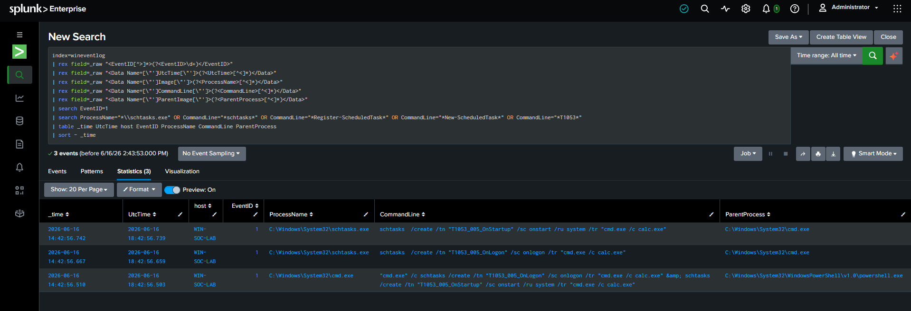

#### Cleanup

```powershell
Invoke-AtomicTest T1053.005 -TestNumbers 1 -Cleanup
```

After cleanup, the detection query shows 6 total events — 3 create + 3 delete — demonstrating full lifecycle visibility.

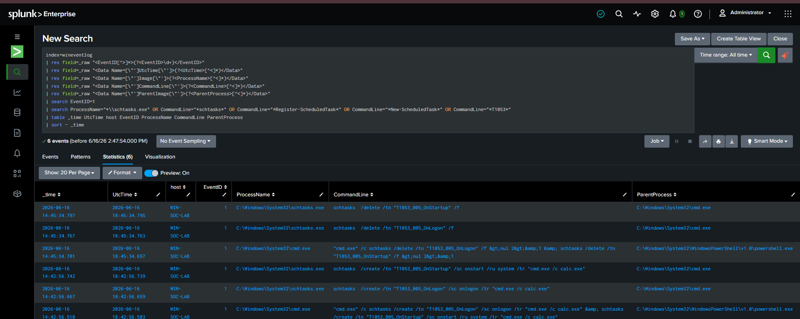

---

### 10.2 T1218.005 — MSHTA Signed Binary Proxy Execution (Defence Evasion)

**MITRE ATT&CK:** [T1218.005](https://attack.mitre.org/techniques/T1218/005/) | Tactic: Defence Evasion

**What it does:** Uses `mshta.exe` — a legitimate, signed Microsoft binary — to fetch and execute a remote JavaScript payload from GitHub. Because `mshta.exe` is trusted by application whitelisting policies, this technique bypasses controls that block unknown executables.

#### Execute Attack

```powershell
Invoke-AtomicTest T1218.005 -TestNumbers 1
```

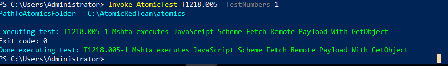

#### SPL Detection Query

```spl
index=wineventlog
| rex field=_raw "<EventID[^>]*>(?<EventID>\d+)</EventID>"
| rex field=_raw "<Data Name=[\"']UtcTime[\"']>(?<UtcTime>[^<]*)</Data>"
| rex field=_raw "<Data Name=[\"']Image[\"']>(?<ProcessName>[^<]*)</Data>"
| rex field=_raw "<Data Name=[\"']CommandLine[\"']>(?<CommandLine>[^<]*)</Data>"
| rex field=_raw "<Data Name=[\"']ParentImage[\"']>(?<ParentProcess>[^<]*)</Data>"
| search EventID=1
| search ProcessName="*\\mshta.exe" OR CommandLine="*mshta*" OR CommandLine="*.hta*" OR CommandLine="*javascript:*" OR CommandLine="*vbscript:*"
| table _time UtcTime host EventID ProcessName CommandLine ParentProcess
| sort - _time
```

**Most helpful Sysmon Event ID:** `Event ID 1 — Process Creation`

**Why:** Captures `mshta.exe` with the full inline `javascript:a=(GetObject(...)).Exec()` command and the remote GitHub URL. The parent `cmd.exe` → `mshta.exe` chain confirms scripted invocation rather than a user double-clicking an `.hta` file.

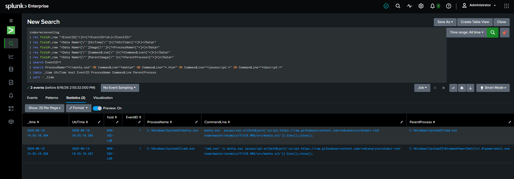

#### Cleanup

```powershell
Invoke-AtomicTest T1218.005 -TestNumbers 1 -Cleanup
```

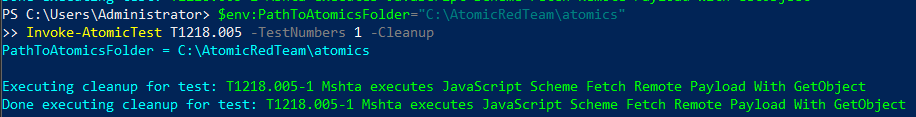

---

### 10.3 T1003.001 — LSASS Memory Credential Dumping (Credential Access)

**MITRE ATT&CK:** [T1003.001](https://attack.mitre.org/techniques/T1003/001/) | Tactic: Credential Access

**What it does:** Uses ProcDump (a Sysinternals tool) to create a full memory dump of the `lsass.exe` process. The resulting `.dmp` file can be analysed offline with Mimikatz to extract plaintext passwords, NTLM hashes, and Kerberos tickets. Do not upload `.dmp` files to GitHub.

#### Execute Attack

```powershell
Invoke-AtomicTest T1003.001 -TestNumbers 1 -GetPrereqs
Invoke-AtomicTest T1003.001 -TestNumbers 1
```

ProcDump downloads automatically and creates a ~47 MB dump at `C:\Windows\Temp\lsass_dump.dmp`.

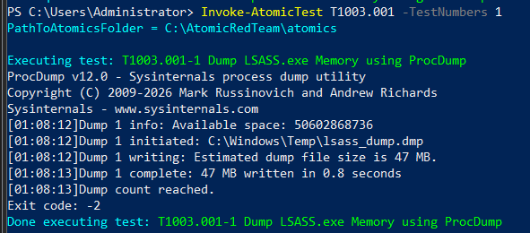

#### SPL Detection Query

```spl
index=wineventlog
| rex field=_raw "<EventID[^>]*>(?<EventID>\d+)</EventID>"
| rex field=_raw "<Data Name=[\"']UtcTime[\"']>(?<UtcTime>[^<]*)</Data>"
| rex field=_raw "<Data Name=[\"']Image[\"']>(?<ProcessName>[^<]*)</Data>"
| rex field=_raw "<Data Name=[\"']CommandLine[\"']>(?<CommandLine>[^<]*)</Data>"
| rex field=_raw "<Data Name=[\"']ParentImage[\"']>(?<ParentProcess>[^<]*)</Data>"
| rex field=_raw "<Data Name=[\"']TargetImage[\"']>(?<TargetImage>[^<]*)</Data>"
| rex field=_raw "<Data Name=[\"']TargetFilename[\"']>(?<TargetFilename>[^<]*)</Data>"
| search (EventID=1 AND (CommandLine="*lsass*" OR ProcessName="*\\procdump*")) OR (EventID=10 AND TargetImage="*\\lsass.exe") OR (EventID=11 AND TargetFilename="*.dmp")
| table _time UtcTime host EventID ProcessName CommandLine ParentProcess TargetImage TargetFilename
| sort - _time
```

**Most helpful Sysmon Event IDs:**

| Event ID | Name | What It Captures |
|---|---|---|
| `1` | Process Create | `procdump64.exe -accepteula -ma lsass.exe` — process + command line |
| `10` | Process Access | ProcDump opening a handle to `lsass.exe` — the access itself |
| `11` | File Create | The `.dmp` file being written to `C:\Windows\Temp\` |

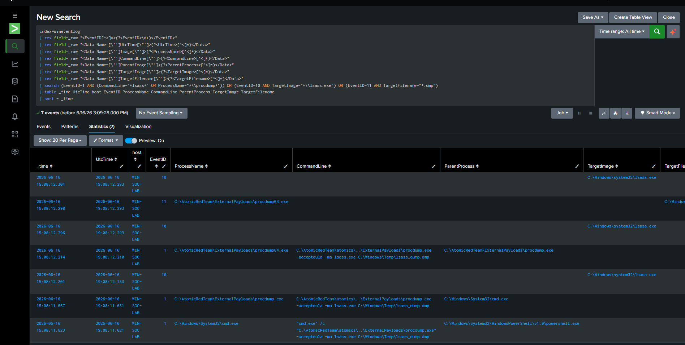

#### Cleanup

```powershell
Invoke-AtomicTest T1003.001 -TestNumbers 1 -Cleanup
Remove-Item C:\Windows\Temp\*.dmp -Force -ErrorAction SilentlyContinue
```

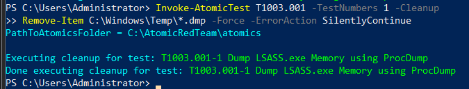

---

### 10.4 T1059.001 — PowerShell Execution (Execution)

**MITRE ATT&CK:** [T1059.001](https://attack.mitre.org/techniques/T1059/001/) | Tactic: Execution

**What it does:** Abuses PowerShell to download and execute remote payloads using built-in cmdlets (`Invoke-WebRequest`, `DownloadString`, `Invoke-Expression`). Attackers often use Base64-encoded `-EncodedCommand` arguments to hide malicious intent from casual inspection.

#### Execute Attack

```powershell
Invoke-AtomicTest T1059.001 -TestNumbers 1
```

> ℹ️ The execution screenshot for this test was not captured during this lab session.

#### SPL Detection Query

```spl
index=wineventlog
| rex field=_raw "<EventID[^>]*>(?<EventID>\d+)</EventID>"
| rex field=_raw "<Data Name=[\"']UtcTime[\"']>(?<UtcTime>[^<]*)</Data>"
| rex field=_raw "<Data Name=[\"']Image[\"']>(?<ProcessName>[^<]*)</Data>"
| rex field=_raw "<Data Name=[\"']CommandLine[\"']>(?<CommandLine>[^<]*)</Data>"
| rex field=_raw "<Data Name=[\"']ParentImage[\"']>(?<ParentProcess>[^<]*)</Data>"
| search EventID=1
| search ProcessName="*\\powershell.exe" OR ProcessName="*\\pwsh.exe"
| search CommandLine="*Invoke-WebRequest*" OR CommandLine="*IEX*" OR CommandLine="*Invoke-Expression*" OR CommandLine="*DownloadString*" OR CommandLine="*http*" OR CommandLine="*-enc*" OR CommandLine="*EncodedCommand*"
| table _time UtcTime host EventID ProcessName CommandLine ParentProcess
| sort - _time
```

**Most helpful Sysmon Event ID:** `Event ID 1 — Process Creation`

**Key detection indicators:**
- `IEX` / `Invoke-Expression` — executing strings as code (CRITICAL)
- `-EncodedCommand` / `-enc` — Base64 obfuscation (CRITICAL)
- `DownloadString` / `Invoke-WebRequest` — remote payload download (HIGH)
- `powershell.exe` spawned by `WmiPrvSE.exe` or `mshta.exe` — remote/lateral execution (HIGH)

#### Cleanup

```powershell
Invoke-AtomicTest T1059.001 -TestNumbers 1 -Cleanup
```

---

### 10.5 T1112 — Registry Modification (Defence Evasion)

**MITRE ATT&CK:** [T1112](https://attack.mitre.org/techniques/T1112/) | Tactic: Defence Evasion

**What it does:** Modifies the Windows registry to disable Windows Defender antispyware protection. Attackers use registry modification to weaken security controls, establish persistence via Run keys, or tamper with audit and logging settings.

#### Execute Attack

```powershell
Invoke-AtomicTest T1112 -TestNumbers 1
```

You can also simulate Defender disabling directly:

```powershell
New-Item "HKLM:\SOFTWARE\Policies\Microsoft\Windows Defender" -Force | Out-Null
Set-ItemProperty "HKLM:\SOFTWARE\Policies\Microsoft\Windows Defender" -Name DisableAntiSpyware -Type DWord -Value 1
```

#### SPL Detection Query

```spl
index=wineventlog
| rex field=_raw "<EventID[^>]*>(?<EventID>\d+)</EventID>"
| rex field=_raw "<Data Name=[\"']UtcTime[\"']>(?<UtcTime>[^<]*)</Data>"
| rex field=_raw "<Data Name=[\"']Image[\"']>(?<ProcessName>[^<]*)</Data>"
| rex field=_raw "<Data Name=[\"']CommandLine[\"']>(?<CommandLine>[^<]*)</Data>"
| rex field=_raw "<Data Name=[\"']TargetObject[\"']>(?<TargetObject>[^<]*)</Data>"
| rex field=_raw "<Data Name=[\"']Details[\"']>(?<Details>[^<]*)</Data>"
| search (EventID=13 AND (TargetObject="*Windows Defender*" OR TargetObject="*DisableAntiSpyware*" OR TargetObject="*Defender*" OR TargetObject="*T1112*"))
      OR (EventID=1 AND (CommandLine="*reg add*" OR CommandLine="*Set-ItemProperty*" OR CommandLine="*Windows Defender*" OR CommandLine="*DisableAntiSpyware*"))
| table _time UtcTime host EventID ProcessName CommandLine TargetObject Details
| sort - _time
```

**Most helpful Sysmon Event IDs:**

| Event ID | Name | What It Captures |
|---|---|---|
| `13` | Registry Value Set | The exact registry key (`HKLM:\SOFTWARE\Policies\Microsoft\Windows Defender`) and value (`DisableAntiSpyware = 1`) being written |
| `1` | Process Create | `reg.exe` or `powershell.exe` executing the registry change command |

#### Cleanup

```powershell
Set-ItemProperty "HKLM:\SOFTWARE\Policies\Microsoft\Windows Defender" -Name DisableAntiSpyware -Type DWord -Value 0
Invoke-AtomicTest T1112 -TestNumbers 1 -Cleanup
```

---

## 11. Splunk Dashboard

Create a **Classic Dashboard** in Splunk to visualise all lab activity in one view.

```
Dashboards → Create New Dashboard
  Dashboard Title: SOC Lab - Sysmon Atomic Red Team Detection
  Dashboard ID:    soc_lab_sysmon_atomic_red_team_detection
  → Classic Dashboards → Create
```

### Panel 1 — Sysmon Event ID Count

```spl
index=wineventlog
| rex field=_raw "<EventID[^>]*>(?<EventID>\d+)</EventID>"
| stats count by EventID
| sort -count
```

*Visualisation: Column chart or table*

---

### Panel 2 — Sysmon Events Over Time

```spl
index=wineventlog
| rex field=_raw "<EventID[^>]*>(?<EventID>\d+)</EventID>"
| timechart span=5m count by EventID
```

*Visualisation: Line chart*

---

### Panel 3 — Top Process Executions

```spl
index=wineventlog
| rex field=_raw "<EventID[^>]*>(?<EventID>\d+)</EventID>"
| rex field=_raw "<Data Name=[\"']Image[\"']>(?<ProcessName>[^<]*)</Data>"
| search EventID=1
| stats count by ProcessName
| sort -count
| head 20
```

*Visualisation: Bar chart or table*

---

### Panel 4 — Atomic Red Team Detection Summary

```spl
index=wineventlog
| rex field=_raw "<EventID[^>]*>(?<EventID>\d+)</EventID>"
| rex field=_raw "<Data Name=[\"']UtcTime[\"']>(?<UtcTime>[^<]*)</Data>"
| rex field=_raw "<Data Name=[\"']Image[\"']>(?<ProcessName>[^<]*)</Data>"
| rex field=_raw "<Data Name=[\"']CommandLine[\"']>(?<CommandLine>[^<]*)</Data>"
| search CommandLine="*schtasks*" OR CommandLine="*mshta*" OR CommandLine="*lsass*" OR CommandLine="*procdump*" OR CommandLine="*powershell*" OR CommandLine="*reg add*" OR CommandLine="*Defender*" OR CommandLine="*Set-ItemProperty*"
| table _time UtcTime host ProcessName CommandLine
| sort - _time
```

*Visualisation: Table*

---

## 12. Repository Structure

```
Splunk-Sysmon-AtomicRedTeam-SOC-Lab/
│
├── README.md
│
├── configs/
│   ├── inputs.conf
│   ├── outputs.conf
│   └── sysmonconfig.xml
│
├── splunk-queries/
│   ├── 01_T1053_scheduled_task.spl
│   ├── 02_T1218_mshta.spl
│   ├── 03_T1003_lsass_dump.spl
│   ├── 04_T1059_powershell.spl
│   ├── 05_T1112_registry_modification.spl
│   └── 06_dashboard_queries.spl
│
└── images/
    ├── 39_kali_splunk_started_again.png
    ├── 40_kali_splunk_port_8000_listening.png
    ├── 37_windows_access_splunk_web.png
    ├── 20_vmware_manual_install_selected.png
    └── ... (all lab screenshots)
```

### configs/inputs.conf

```ini
[WinEventLog://Microsoft-Windows-Sysmon/Operational]
disabled = 0
index = wineventlog
renderXml = true
```

### configs/outputs.conf

```ini
[tcpout]
defaultGroup = kali_indexer

[tcpout:kali_indexer]
server = 192.168.116.128:9997
```

---

## Final Submission Checklist

- [ ] Kali Splunk Enterprise installed and running (`splunkd is running`)
- [ ] Splunk Web reachable on port `8000`
- [ ] Receiving port `9997` enabled and listening
- [ ] Index `wineventlog` created in Splunk
- [ ] Windows Server 2019 installed with **Desktop Experience**
- [ ] Sysmon installed and generating events (service: `Running`)
- [ ] Universal Forwarder installed, `inputs.conf` and `outputs.conf` configured
- [ ] `list forward-server` shows active forward to `192.168.116.128:9997`
- [ ] `index=wineventlog` returns Sysmon events in Splunk
- [ ] EventID 1 shows `ProcessName`, `CommandLine`, `ParentProcess`, `host`, `time`
- [ ] All five attack detections have Splunk screenshots
- [ ] Dashboard created with all four panels
- [ ] No `.dmp` files, passwords, or credentials in the repository
- [ ] GitHub repository is **public**
- [ ] All README images load correctly

---

## References

| Resource | Link |
|---|---|
| Splunk Enterprise | https://www.splunk.com/en_us/download/splunk-enterprise.html |
| Splunk Universal Forwarder | https://www.splunk.com/en_us/download/universal-forwarder.html |
| Microsoft Sysmon | https://learn.microsoft.com/en-us/sysinternals/downloads/sysmon |
| Microsoft ProcDump | https://learn.microsoft.com/en-us/sysinternals/downloads/procdump |
| Atomic Red Team | https://github.com/redcanaryco/atomic-red-team |
| Invoke-AtomicRedTeam Docs | https://www.atomicredteam.io/docs/invoke-atomicredteam |
| MITRE ATT&CK Framework | https://attack.mitre.org/ |

---

*This lab was built and tested in a fully isolated VMware NAT environment. All attack simulations were conducted for educational and detection engineering purposes only.*
